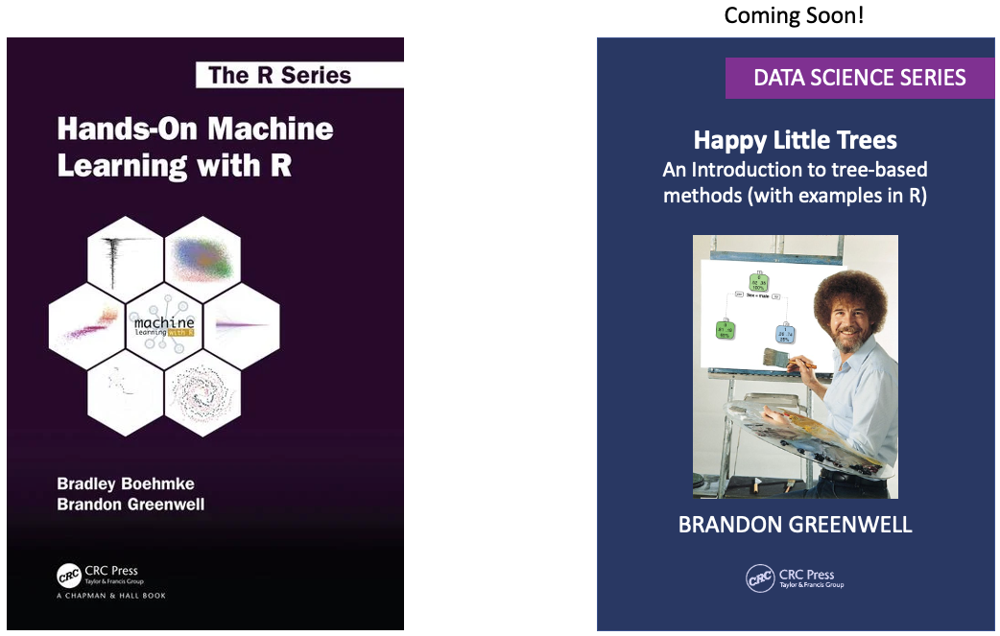
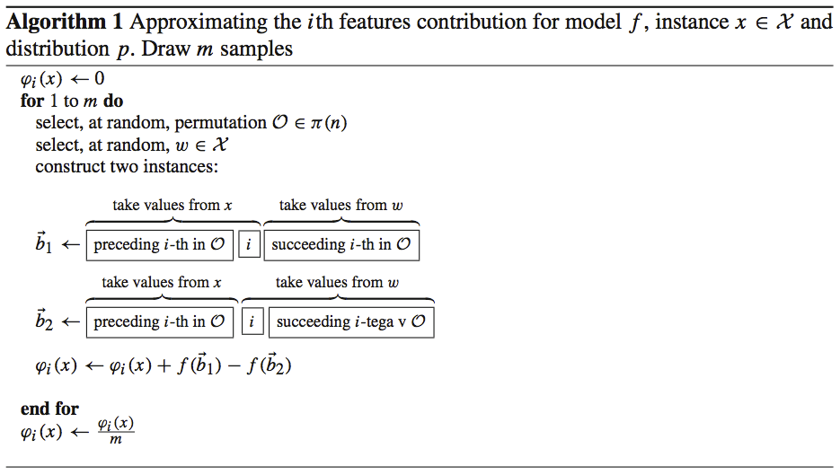
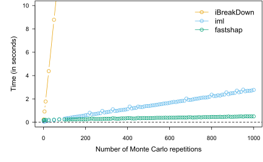
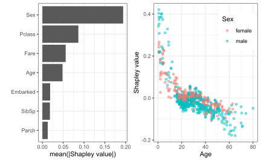
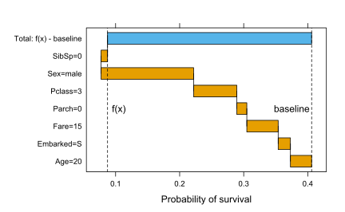
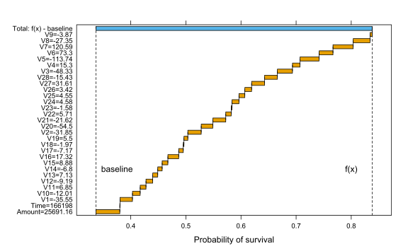

## Shameless plug...📚

.pull-left[

]

--

.pull-right[

]


---


## Explaining individual predictions

* While discovering which features have the biggest *overall* impact on the model is important, it is often more informative to determine:

  .center.MediumSeaGreen[Which features impacted a specific set of predictions, and how?]

* We can think of this as *local* (or *case-wise*) *variable importance*

  - More generally referred to as *prediction explanations* or .magenta[*feature contributions*]  
  
* Many different flavors, but we'll focus on (arguably) the most popular: .dodgerblue[*Shapley explanations*]


---

## Shapley explanations

For an arbitrary observation $\boldsymbol{x}_0$, Shapley values provide a measure of each feature values contribution to the difference

$$\hat{f}\left(\boldsymbol{x}_0\right) - \sum_{i = 1}^N \hat{f}\left(\boldsymbol{x}_i\right)$$
* Based on [Shapley values](https://en.wikipedia.org/wiki/Shapley_value), an idea from *game theory* 😱

* Can be computed for all training rows and aggregated into useful summaries (e.g., variable importance)

* The only prediction explanation method to satisfy several useful properties of .dodgerblue[*fairness*]:

  1. Local accuracy (efficiency)
  2. Missingness
  3. Consistency (monotonicity)


---

## So, what's a Shapley value?

--

In .forestgreen[*cooperative game theory*], the Shapley value is the average marginal contribution of a .forestgreen[*player*] across all possible .forestgreen[*coalitions*] in a .forestgreen[*game*] [(Shapley, 1951)](https://www.rand.org/content/dam/rand/pubs/research_memoranda/2008/RM670.pdf):

$$\phi_i\left(val\right) = \frac{1}{p!} \sum_{\mathcal{O} \in \pi\left(p\right)} \left[\Delta Pre^i\left(\mathcal{O}\right) \cup \left\{i\right\} - Pre^i\left(\mathcal{O}\right)\right], \quad i = 1, 2, \dots, p$$

--

.pull-left[


]

.pull-right[

.font90[
In the context of predictive modeling:

* .purple[**Game**] = prediction task for a single observation $\boldsymbol{x}_0$
* .purple[**Players**] = the feature values of $\boldsymbol{x}_0$ that collaborate to receive the gain (i.e., predict a certain value)
* .purple[**Gain**] = prediction for $\boldsymbol{x}_0$ minus the average prediction for all training observations

]

]


---

## Approximating Shapley values

.purple[**For the programmers**], implementing approximate Shapley explanations is rather straightforward [(Strumbelj et al., 2014)](https://dl.acm.org/doi/10.1007/s10115-013-0679-x):

.center[

]


---
class: middle

A poor-man's implementation in R...


```r
sample.shap <- function(f, obj, R, x, feature, X) {
  phi <- numeric(R)  # to store Shapley values
  N <- nrow(X)  # sample size
  p <- ncol(X)  # number of features
  b1 <- b2 <- x
  for (m in seq_len(R)) {
*   w <- X[sample(N, size = 1), ]  # randomly drawn instance
*   ord <- sample(names(w))  # random permutation of features
*   swap <- ord[seq_len(which(ord == feature) - 1)]
*   b1[swap] <- w[swap]
*   b2[c(swap, feature)] <- w[c(swap, feature)]
*   phi[m] <- f(obj, newdata = b1) - f(obj, newdata = b2)
  }
  mean(phi)
}
```


---
class: middle

## Enter...**fastshap**

* Explaining $N$ instances with $p$ features would require $2 \times m \times N \times p$ calls to $\hat{f}\left(\right)$ 
* [fastshap](https://cran.r-project.org/package=fastshap) reduces this to $2 \times m \times p$

  - Trick here is to generate all the "Frankenstein instances" up front, and score the differences once: $\hat{f}\left(\boldsymbol{B}_1\right) - \hat{f}\left(\boldsymbol{B}_2\right)$
  
      * Logical subsetting! (http://adv-r.had.co.nz/Subsetting.html)
      
  - It's also parallelized across predictors (not by default)
  
  - Supports Tree SHAP implementations in both the [xgboost](https://cran.r-project.org/package=xgboost) and [lightgbm](https://cran.r-project.org/package=lightgbm) packages (woot!)


---
class: middle

## Simple benchmark

Explaining a single observation from a [ranger](https://cran.r-project.org/web/packages/ranger/index.html)-based random forest fit to the well-known [titanic](https://cran.r-project.org/package=titanic) data set.



---
class: middle

### Example: understanding survival on the Titanic

.scrollable.code70[

```r
library(ggplot2)
library(ranger)
library(fastshap)

# Set ggplot2 theme
theme_set(theme_bw())

# Read in the data and clean it up a bit
titanic <- titanic::titanic_train
features <- c(
  "Survived",  # passenger survival indicator
  "Pclass",    # passenger class
  "Sex",       # gender
  "Age",       # age
  "SibSp",     # number of siblings/spouses aboard
  "Parch",     # number of parents/children aboard
  "Fare",      # passenger fare
  "Embarked"   # port of embarkation
)
titanic <- titanic[, features]
titanic$Survived <- as.factor(titanic$Survived)
titanic <- na.omit(titanic)  # ...umm?
```
]


---
class: middle

### Example: understanding survival on the Titanic

.scrollable.code70[

```r
# Fit a (default) random forest
set.seed(1046)  # for reproducibility
rfo <- ranger(Survived ~ ., data = titanic, probability = TRUE)

# Prediction wrapper for `fastshap::explain()`; has to return a 
# single (atomic) vector of predictions
pfun <- function(object, newdata) {  # computes prob(Survived=1|x)
  predict(object, data = newdata)$predictions[, 2]
}

# Estimate feature contributions for each imputed training set
X <- subset(titanic, select = -Survived)  # features only!
set.seed(1051)  # for reproducibility
*(ex.all <- explain(rfo, X = X, nsim = 100, adjust = TRUE,  pred_wrapper = pfun))
```

```
## # A tibble: 714 x 7
##     Pclass     Sex      Age    SibSp     Parch     Fare Embarked
##      <dbl>   <dbl>    <dbl>    <dbl>     <dbl>    <dbl>    <dbl>
##  1 -0.0431 -0.184  -0.00469  0.0140  -0.0121   -0.0301  -0.0181 
##  2  0.170   0.270  -0.0114   0.00204  0.00164   0.114    0.0378 
##  3 -0.122   0.230   0.0226   0.0209  -0.00687  -0.0258  -0.0172 
##  4  0.156   0.288   0.0106  -0.00589  0.00361   0.123   -0.00997
##  5 -0.0413 -0.157  -0.0320   0.0141  -0.00523  -0.0710  -0.00295
##  6  0.0550 -0.197  -0.117   -0.00330 -0.00210   0.0704  -0.0103 
##  7 -0.0857 -0.0972  0.220   -0.157    0.0182   -0.0709  -0.00627
##  8 -0.113   0.264   0.0518   0.0318   0.0575    0.0294  -0.00218
##  9  0.0796  0.323   0.0406  -0.00369 -0.000850  0.00905  0.0520 
## 10 -0.110   0.140   0.239   -0.00889  0.0389    0.0482  -0.00439
## # ... with 704 more rows
```
]


---
class: middle

### Example: understanding survival on the Titanic

.scrollable.code70[

```r
p1 <- autoplot(ex.all)
p2 <- autoplot(ex.all, type = "dependence", feature = "Age", X = X,
               color_by = "Sex", alpha = 0.5) + theme(legend.position = c(0.8, 0.8))
gridExtra::grid.arrange(p1, p2, nrow = 1)
```


]


---
class: middle

### Example: understanding survival on the Titanic

Explaining an individual row (i.e., passenger); inspiration for this example taken from [here](https://modeloriented.github.io/iBreakDown/articles/vignette_iBreakDown_titanic.html).

.pull-left[
.scrollable.code70[

```r
# Explain an individual passenger
jack.dawson <- data.frame(
  # Survived = factor(0, levels = 0:1),  # in case you haven't seen the movie
  Pclass = 3,
  Sex = factor("male", levels = c("female", "male")),
  Age = 20,
  SibSp = 0,
  Parch = 0,
  Fare = 15,  # lower end of third-class ticket prices
  Embarked = factor("S", levels = c("", "C", "Q", "S"))
)
```
]

]
.pull-right[


]


---
class: middle

### Example: understanding survival on the Titanic

.scrollable.code70[

```r
(pred.jack <- pfun(rfo, newdata = jack.dawson))
```

```
##          1 
## 0.08742743
```

```r
(baseline <- mean(pfun(rfo, newdata = X)))
```

```
## [1] 0.406058
```

```r
# Estimate feature contributions for Jack's predicted probability
set.seed(754)  # for reproducibility
(ex.jack <- explain(rfo, X = X, newdata = jack.dawson, nsim = 1000, 
                    adjust = TRUE, pred_wrapper = pfun))
```

```
## # A tibble: 1 x 7
##    Pclass    Sex     Age  SibSp   Parch    Fare Embarked
##     <dbl>  <dbl>   <dbl>  <dbl>   <dbl>   <dbl>    <dbl>
## 1 -0.0675 -0.144 -0.0331 0.0101 -0.0156 -0.0490  -0.0192
```
]


---
class: middle

### Example: understanding survival on the Titanic




---
class: middle

### Example: understanding anomalous credit card transactions

.scrollable.code70[

```r
library(fastshap)
library(ggplot2)
library(isotree)

# Set ggplot2 theme
theme_set(theme_bw())

*# URL: https://www.kaggle.com/mlg-ulb/creditcardfraud

# Read in credit card fraud data
ccfraud <- data.table::fread("data/ccfraud.csv")

# Randomize the data
set.seed(2117)  # for reproducibility
ccfraud <- ccfraud[sample(nrow(ccfraud)), ]

# Split data into train/test sets
set.seed(2013)  # for reproducibility
trn.id <- sample(nrow(ccfraud), size = 10000, replace = FALSE)
ccfraud.trn <- ccfraud[trn.id, ]
ccfraud.tst <- ccfraud[-trn.id, ]
```
]


---
class: middle

### Example: understanding anomalous credit card transactions

.scrollable.code70[

```r
# Fit a default isolation forest (unsupervised)
ifo <- isolation.forest(ccfraud.trn[, 1L:30L], random_seed = 2223, 
                        nthreads = 1)

# Compute anomaly scores for the test observations
head(scores <- predict(ifo, newdata = ccfraud.tst))
```

```
## [1] 0.3182065 0.3425736 0.3238238 0.3229748 0.3384741 0.3268937
```
]


---
class: middle

### Example: understanding anomalous credit card transactions

.scrollable.code70[

```r
# Find test observations corresponding to maximum anomaly score
max.id <- which.max(scores)  # row ID for observation wit
max.x <- ccfraud.tst[max.id, ]
max(scores)
```

```
## [1] 0.8379214
```

```r
X <- ccfraud.trn[, 1L:30L]  # feature columns only!
max.x <- max.x[, 1L:30L]  # feature columns only!
pfun <- function(object, newdata) {  # prediction wrapper
  predict(object, newdata = newdata)
}

# Generate feature contributions
set.seed(1351)  # for reproducibility
ex <- explain(ifo, X = X, newdata = max.x, pred_wrapper = pfun, 
              adjust = TRUE, nsim = 1000)

# Should sum to f(x) - baseline whenever `adjust = TRUE`
sum(ex)   
```

```
## [1] 0.5010727
```
]


---
class: middle

### Example: understanding anomalous credit card transactions




---

## Good resources

* [Interpretable Machine Learning: A Guide for Making Black Box Models Explainable](https://christophm.github.io/interpretable-ml-book/)
  
  - Christoph Molnar is also the creator of the well-known [iml package](https://cran.r-project.org/package=iml)
  
* In-progress [article](https://github.com/bgreenwell/rjournal-shapley) on Shapley explanations for [*The R Journal*](https://journal.r-project.org/)

  - Consider contributing 😄
  
* [Explanatory Model Analysis: Explore, Explain, and Examine Predictive Models. With examples in R and Python](https://ema.drwhy.ai/)

  - Authors associated with the [DALEX](https://github.com/ModelOriented/DALEX) ecosystem for IML

---
class: middle, center

## Thank you


